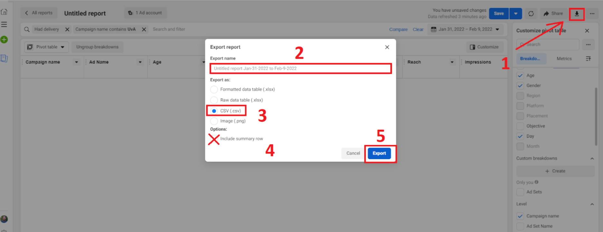

```{r setup, include=FALSE}
knitr::opts_chunk$set(echo = TRUE)

```


Enter your URL here:
<input type="text" id="input_url" size="100">
<button onclick="generateLinks()">Generate Links</button>

<div id="instructions" style="display: none;">

<i>This worked!</i> Please follow the following instructions:

  <ol>
    <li>Click the “click here” links in the table below. You should now be in the ad manager report view.</li>
    <br>
    <li>Click on the 'export' button at the top right (see image below table).</li>
    <br>
    <li><b>IMPORTANT:</b> name each file according to the names in the table.</li>
    <br>
    <li>Checkmark: export as .csv file.</li>
    <br>
    <li>Make sure the 'include summary row' option is checked.</li>
    <br>
    <li>Click export.</li>
  </ol>
  
Repeat this 10 times for all Links from 1-10 in your generated table. The entire job takes about 15 minutes.

Once you downloaded all the files and named them correctly, **please upload them to the secure storage of the University of Amsterdam**. You received a personalized link and password via e-mail. 

Ensure that you are uploading <u><b>10 files</b></u>.

*Note: please always follow the links and do not generate the reports by selecting the breakdown variables yourself because it will lack important information.*
</div>


<div id="links_table"></div>


<div id="instructions2" style="display: none;">
<center>


*Description: this is how your website should look like once you clicked on any of the links and on the export button in the upper right.*

</center>
</div>

<div id="firstinstructions">

This page generates *personalized* links for your report manager. 

Navigate to the correct ad business account on Facebook Ads Manager.
Copy the current URL from the address bar.

The URL should include the ad account ID and business ID. If it doesn't try clicking on any button within the ad manager, it should refresh and give the correct IDs.

For example, the URL might look like this: <i>https://adsmanager.facebook.com/adsmanager/manage/campaigns?act=238077227&business_id=1794354014105845</i>

The important parts are: "act=XXXXXXX" and "business_id=XXXXXX"

*Note: when you enter the URL everything is processed locally in your browser, no data is stored.*


</div>

<style>
#links_table table {
  width: 100%;
  border-collapse: collapse;
  margin-top: 20px;
}
#links_table th, #links_table td {
  border: 1px solid black;
  padding: 10px;
  text-align: left;
}
#links_table th {
  background-color: #000;
}
#links_table tr:nth-child(even) {
  background-color: #f9f9f9;
}
</style>

<script>
function getParam(url, param) {
  var urlParams = new URLSearchParams(new URL(url).search);
  return urlParams.get(param);
}

function generateLinks() {
  var base_url = document.getElementById('input_url').value;
  var act_id = getParam(base_url, 'act');
  var business_id = getParam(base_url, 'business_id');

  if (!act_id || !business_id) {
    alert('Invalid URL. Please ensure it contains act and business_id parameters.');
    return;
  }

  var links = [
    { name: "Name it <b>overview</b>", url: "https://adsmanager.facebook.com/adsmanager/reporting/view?event_source=CLICK_CREATE_REPORT&breakdowns=campaign_name%2Cad_name%2Cadset_name%2Cpage_name&empty_comparison_time_range=true&filter_set=had_delivery-STRING%1EEQUAL%1E%221%22%1Dcampaign_name-STRING%1ECONTAIN%1E%22Research%20-%22&locked_dimensions=1&metrics=delivery_info%2Creach%2Cimpressions%2Cfrequency%2Cattribution_setting%2Cresults%2Cspend%2Ccost_per_result%2Cdelivery_start%2Cactions%3Alink_click%2Ccost_per_action_type%3Alink_click%2Ccpm%2Cctr%2Ccpc%2Cclicks%2Cquality_score_organic%2Cquality_score_ectr%2Cquality_score_ecvr%2Ccpp%2Cad_delivery%2Cactions%3Apage_engagement%2Cactions%3Alike%2Cactions%3Acomment%2Cactions%3Apost_engagement%2Cactions%3Apost_reaction%2Cactions%3Aonsite_conversion.post_save%2Cactions%3Apost%2Cactions%3Aphoto_view%2Ccost_per_action_type%3Apage_engagement%2Ccost_per_action_type%3Alike%2Ccost_per_action_type%3Apost_engagement%2Cunique_actions%3Alink_click%2Coutbound_clicks%3Aoutbound_click%2Cunique_outbound_clicks%3Aoutbound_click%2Cwebsite_ctr%3Alink_click%2Cunique_link_clicks_ctr%2Coutbound_clicks_ctr%3Aoutbound_click%2Cunique_outbound_clicks_ctr%3Aoutbound_click%2Cunique_clicks%2Cunique_ctr%2Ccost_per_unique_action_type%3Alink_click%2Ccost_per_outbound_click%3Aoutbound_click%2Ccost_per_unique_outbound_click%3Aoutbound_click%2Ccost_per_unique_click%2Caccount_id%2Caccount_name%2Cbody%2Cresult_rate%2Cimpressions_gross%2Cimpressions_auto_refresh%2Cbuying_type%2Cadset_bid_value%2Cadset_budget_value%2Clink_url%2Caccount_currency%2Caccount_timezone%2Cdescription%2Cheadline%2Cobjective%2Ccampaign_budget_value%2Ccall_to_action_type%2Cimage_hash%2Cimage_name%2Cwebsite_url%2Cpage_id%2Ccampaign_id%2Cadset_id%2Cad_id&sort_spec=days_1~desc&time_range=2024-04-25_2024-05-30" },
    { name: "Name it <b>overview_day</b>", url: "https://adsmanager.facebook.com/adsmanager/reporting/view?event_source=CLICK_CREATE_REPORT&breakdowns=campaign_name%2Cad_name%2Cadset_name%2Cpage_name%2Cdays_1&empty_comparison_time_range=true&filter_set=had_delivery-STRING%1EEQUAL%1E%221%22%1Dcampaign_name-STRING%1ECONTAIN%1E%22Research%20-%22&locked_dimensions=1&metrics=delivery_info%2Creach%2Cimpressions%2Cfrequency%2Cattribution_setting%2Cresults%2Cspend%2Ccost_per_result%2Cdelivery_start%2Cactions%3Alink_click%2Ccost_per_action_type%3Alink_click%2Ccpm%2Cctr%2Ccpc%2Cclicks%2Cquality_score_organic%2Cquality_score_ectr%2Cquality_score_ecvr%2Ccpp%2Cad_delivery%2Cactions%3Apage_engagement%2Cactions%3Alike%2Cactions%3Acomment%2Cactions%3Apost_engagement%2Cactions%3Apost_reaction%2Cactions%3Aonsite_conversion.post_save%2Cactions%3Apost%2Cactions%3Aphoto_view%2Ccost_per_action_type%3Apage_engagement%2Ccost_per_action_type%3Alike%2Ccost_per_action_type%3Apost_engagement%2Cunique_actions%3Alink_click%2Coutbound_clicks%3Aoutbound_click%2Cunique_outbound_clicks%3Aoutbound_click%2Cwebsite_ctr%3Alink_click%2Cunique_link_clicks_ctr%2Coutbound_clicks_ctr%3Aoutbound_click%2Cunique_outbound_clicks_ctr%3Aoutbound_click%2Cunique_clicks%2Cunique_ctr%2Ccost_per_unique_action_type%3Alink_click%2Ccost_per_outbound_click%3Aoutbound_click%2Ccost_per_unique_outbound_click%3Aoutbound_click%2Ccost_per_unique_click%2Caccount_id%2Caccount_name%2Cbody%2Cresult_rate%2Cimpressions_gross%2Cimpressions_auto_refresh%2Cbuying_type%2Cadset_bid_value%2Cadset_budget_value%2Clink_url%2Caccount_currency%2Caccount_timezone%2Cdescription%2Cheadline%2Cobjective%2Ccampaign_budget_value%2Ccall_to_action_type%2Cimage_hash%2Cimage_name%2Cwebsite_url%2Cpage_id%2Ccampaign_id%2Cadset_id%2Cad_id&sort_spec=days_1~desc&time_range=2024-04-25_2024-05-30" },
    { name: "Name it <b>overview_daytime</b>", url: "https://adsmanager.facebook.com/adsmanager/reporting/view?event_source=CLICK_CREATE_REPORT&breakdowns=campaign_name%2Cad_name%2Cadset_name%2Cpage_name%2Cdays_1%2Chourly_stats_aggregated_by_advertiser_time_zone&empty_comparison_time_range=true&filter_set=had_delivery-STRING%1EEQUAL%1E%221%22%1Dcampaign_name-STRING%1ECONTAIN%1E%22Research%20-%22&locked_dimensions=1&metrics=delivery_info%2Creach%2Cimpressions%2Cfrequency%2Cattribution_setting%2Cresults%2Cspend%2Ccost_per_result%2Cdelivery_start%2Cactions%3Alink_click%2Ccost_per_action_type%3Alink_click%2Ccpm%2Cctr%2Ccpc%2Cclicks%2Cquality_score_organic%2Cquality_score_ectr%2Cquality_score_ecvr%2Ccpp%2Cad_delivery%2Cactions%3Apage_engagement%2Cactions%3Alike%2Cactions%3Acomment%2Cactions%3Apost_engagement%2Cactions%3Apost_reaction%2Cactions%3Aonsite_conversion.post_save%2Cactions%3Apost%2Cactions%3Aphoto_view%2Ccost_per_action_type%3Apage_engagement%2Ccost_per_action_type%3Alike%2Ccost_per_action_type%3Apost_engagement%2Cunique_actions%3Alink_click%2Coutbound_clicks%3Aoutbound_click%2Cunique_outbound_clicks%3Aoutbound_click%2Cwebsite_ctr%3Alink_click%2Cunique_link_clicks_ctr%2Coutbound_clicks_ctr%3Aoutbound_click%2Cunique_outbound_clicks_ctr%3Aoutbound_click%2Cunique_clicks%2Cunique_ctr%2Ccost_per_unique_action_type%3Alink_click%2Ccost_per_outbound_click%3Aoutbound_click%2Ccost_per_unique_outbound_click%3Aoutbound_click%2Ccost_per_unique_click%2Caccount_id%2Caccount_name%2Cbody%2Cresult_rate%2Cimpressions_gross%2Cimpressions_auto_refresh%2Cbuying_type%2Cadset_bid_value%2Cadset_budget_value%2Clink_url%2Caccount_currency%2Caccount_timezone%2Cdescription%2Cheadline%2Cobjective%2Ccampaign_budget_value%2Ccall_to_action_type%2Cimage_hash%2Cimage_name%2Cwebsite_url%2Cpage_id%2Ccampaign_id%2Cadset_id%2Cad_id&sort_spec=days_1~desc&time_range=2024-04-25_2024-05-30" },
    { name: "Name it <b>age</b>", url: "https://adsmanager.facebook.com/adsmanager/reporting/view?event_source=CLICK_CREATE_REPORT&breakdowns=campaign_name%2Cad_name%2Cadset_name%2Cpage_name%2Cage&empty_comparison_time_range=true&filter_set=had_delivery-STRING%1EEQUAL%1E%221%22%1Dcampaign_name-STRING%1ECONTAIN%1E%22Research%20-%22&locked_dimensions=1&metrics=delivery_info%2Creach%2Cimpressions%2Cfrequency%2Cattribution_setting%2Cresults%2Cspend%2Ccost_per_result%2Cdelivery_start%2Cactions%3Alink_click%2Ccost_per_action_type%3Alink_click%2Ccpm%2Cctr%2Ccpc%2Cclicks%2Cquality_score_organic%2Cquality_score_ectr%2Cquality_score_ecvr%2Ccpp%2Cad_delivery%2Cactions%3Apage_engagement%2Cactions%3Alike%2Cactions%3Acomment%2Cactions%3Apost_engagement%2Cactions%3Apost_reaction%2Cactions%3Aonsite_conversion.post_save%2Cactions%3Apost%2Cactions%3Aphoto_view%2Ccost_per_action_type%3Apage_engagement%2Ccost_per_action_type%3Alike%2Ccost_per_action_type%3Apost_engagement%2Cunique_actions%3Alink_click%2Coutbound_clicks%3Aoutbound_click%2Cunique_outbound_clicks%3Aoutbound_click%2Cwebsite_ctr%3Alink_click%2Cunique_link_clicks_ctr%2Coutbound_clicks_ctr%3Aoutbound_click%2Cunique_outbound_clicks_ctr%3Aoutbound_click%2Cunique_clicks%2Cunique_ctr%2Ccost_per_unique_action_type%3Alink_click%2Ccost_per_outbound_click%3Aoutbound_click%2Ccost_per_unique_outbound_click%3Aoutbound_click%2Ccost_per_unique_click%2Caccount_id%2Caccount_name%2Cbody%2Cresult_rate%2Cimpressions_gross%2Cimpressions_auto_refresh%2Cbuying_type%2Cadset_bid_value%2Cadset_budget_value%2Clink_url%2Caccount_currency%2Caccount_timezone%2Cdescription%2Cheadline%2Cobjective%2Ccampaign_budget_value%2Ccall_to_action_type%2Cimage_hash%2Cimage_name%2Cwebsite_url%2Cpage_id%2Ccampaign_id%2Cadset_id%2Cad_id&sort_spec=days_1~desc&time_range=2024-04-25_2024-05-30" },
    { name: "Name it <b>gender</b>", url: "https://adsmanager.facebook.com/adsmanager/reporting/view?event_source=CLICK_CREATE_REPORT&breakdowns=campaign_name%2Cad_name%2Cadset_name%2Cpage_name%2Cgender&empty_comparison_time_range=true&filter_set=had_delivery-STRING%1EEQUAL%1E%221%22%1Dcampaign_name-STRING%1ECONTAIN%1E%22Research%20-%22&locked_dimensions=1&metrics=delivery_info%2Creach%2Cimpressions%2Cfrequency%2Cattribution_setting%2Cresults%2Cspend%2Ccost_per_result%2Cdelivery_start%2Cactions%3Alink_click%2Ccost_per_action_type%3Alink_click%2Ccpm%2Cctr%2Ccpc%2Cclicks%2Cquality_score_organic%2Cquality_score_ectr%2Cquality_score_ecvr%2Ccpp%2Cad_delivery%2Cactions%3Apage_engagement%2Cactions%3Alike%2Cactions%3Acomment%2Cactions%3Apost_engagement%2Cactions%3Apost_reaction%2Cactions%3Aonsite_conversion.post_save%2Cactions%3Apost%2Cactions%3Aphoto_view%2Ccost_per_action_type%3Apage_engagement%2Ccost_per_action_type%3Alike%2Ccost_per_action_type%3Apost_engagement%2Cunique_actions%3Alink_click%2Coutbound_clicks%3Aoutbound_click%2Cunique_outbound_clicks%3Aoutbound_click%2Cwebsite_ctr%3Alink_click%2Cunique_link_clicks_ctr%2Coutbound_clicks_ctr%3Aoutbound_click%2Cunique_outbound_clicks_ctr%3Aoutbound_click%2Cunique_clicks%2Cunique_ctr%2Ccost_per_unique_action_type%3Alink_click%2Ccost_per_outbound_click%3Aoutbound_click%2Ccost_per_unique_outbound_click%3Aoutbound_click%2Ccost_per_unique_click%2Caccount_id%2Caccount_name%2Cbody%2Cresult_rate%2Cimpressions_gross%2Cimpressions_auto_refresh%2Cbuying_type%2Cadset_bid_value%2Cadset_budget_value%2Clink_url%2Caccount_currency%2Caccount_timezone%2Cdescription%2Cheadline%2Cobjective%2Ccampaign_budget_value%2Ccall_to_action_type%2Cimage_hash%2Cimage_name%2Cwebsite_url%2Cpage_id%2Ccampaign_id%2Cadset_id%2Cad_id&sort_spec=days_1~desc&time_range=2024-04-25_2024-05-30" },
    { name: "Name it <b>age_gender</b>", url: "https://adsmanager.facebook.com/adsmanager/reporting/view?event_source=CLICK_CREATE_REPORT&breakdowns=campaign_name%2Cad_name%2Cadset_name%2Cpage_name%2Cgender%2Cage&empty_comparison_time_range=true&filter_set=had_delivery-STRING%1EEQUAL%1E%221%22%1Dcampaign_name-STRING%1ECONTAIN%1E%22Research%20-%22&locked_dimensions=1&metrics=delivery_info%2Creach%2Cimpressions%2Cfrequency%2Cattribution_setting%2Cresults%2Cspend%2Ccost_per_result%2Cdelivery_start%2Cactions%3Alink_click%2Ccost_per_action_type%3Alink_click%2Ccpm%2Cctr%2Ccpc%2Cclicks%2Cquality_score_organic%2Cquality_score_ectr%2Cquality_score_ecvr%2Ccpp%2Cad_delivery%2Cactions%3Apage_engagement%2Cactions%3Alike%2Cactions%3Acomment%2Cactions%3Apost_engagement%2Cactions%3Apost_reaction%2Cactions%3Aonsite_conversion.post_save%2Cactions%3Apost%2Cactions%3Aphoto_view%2Ccost_per_action_type%3Apage_engagement%2Ccost_per_action_type%3Alike%2Ccost_per_action_type%3Apost_engagement%2Cunique_actions%3Alink_click%2Coutbound_clicks%3Aoutbound_click%2Cunique_outbound_clicks%3Aoutbound_click%2Cwebsite_ctr%3Alink_click%2Cunique_link_clicks_ctr%2Coutbound_clicks_ctr%3Aoutbound_click%2Cunique_outbound_clicks_ctr%3Aoutbound_click%2Cunique_clicks%2Cunique_ctr%2Ccost_per_unique_action_type%3Alink_click%2Ccost_per_outbound_click%3Aoutbound_click%2Ccost_per_unique_outbound_click%3Aoutbound_click%2Ccost_per_unique_click%2Caccount_id%2Caccount_name%2Cbody%2Cresult_rate%2Cimpressions_gross%2Cimpressions_auto_refresh%2Cbuying_type%2Cadset_bid_value%2Cadset_budget_value%2Clink_url%2Caccount_currency%2Caccount_timezone%2Cdescription%2Cheadline%2Cobjective%2Ccampaign_budget_value%2Ccall_to_action_type%2Cimage_hash%2Cimage_name%2Cwebsite_url%2Cpage_id%2Ccampaign_id%2Cadset_id%2Cad_id&sort_spec=days_1~desc&time_range=2024-04-01_2024-05-30" },
    { name: "Name it <b>age_gender_time</b>", url: "https://adsmanager.facebook.com/adsmanager/reporting/view?event_source=CLICK_CREATE_REPORT&breakdowns=campaign_name%2Cad_name%2Cadset_name%2Cpage_name%2Cgender%2Cage%2Cdays_1&empty_comparison_time_range=true&filter_set=had_delivery-STRING%1EEQUAL%1E%221%22%1Dcampaign_name-STRING%1ECONTAIN%1E%22Research%20-%22&locked_dimensions=1&metrics=delivery_info%2Creach%2Cimpressions%2Cfrequency%2Cattribution_setting%2Cresults%2Cspend%2Ccost_per_result%2Cdelivery_start%2Cactions%3Alink_click%2Ccost_per_action_type%3Alink_click%2Ccpm%2Cctr%2Ccpc%2Cclicks%2Cquality_score_organic%2Cquality_score_ectr%2Cquality_score_ecvr%2Ccpp%2Cad_delivery%2Cactions%3Apage_engagement%2Cactions%3Alike%2Cactions%3Acomment%2Cactions%3Apost_engagement%2Cactions%3Apost_reaction%2Cactions%3Aonsite_conversion.post_save%2Cactions%3Apost%2Cactions%3Aphoto_view%2Ccost_per_action_type%3Apage_engagement%2Ccost_per_action_type%3Alike%2Ccost_per_action_type%3Apost_engagement%2Cunique_actions%3Alink_click%2Coutbound_clicks%3Aoutbound_click%2Cunique_outbound_clicks%3Aoutbound_click%2Cwebsite_ctr%3Alink_click%2Cunique_link_clicks_ctr%2Coutbound_clicks_ctr%3Aoutbound_click%2Cunique_outbound_clicks_ctr%3Aoutbound_click%2Cunique_clicks%2Cunique_ctr%2Ccost_per_unique_action_type%3Alink_click%2Ccost_per_outbound_click%3Aoutbound_click%2Ccost_per_unique_outbound_click%3Aoutbound_click%2Ccost_per_unique_click%2Caccount_id%2Caccount_name%2Cbody%2Cresult_rate%2Cimpressions_gross%2Cimpressions_auto_refresh%2Cbuying_type%2Cadset_bid_value%2Cadset_budget_value%2Clink_url%2Caccount_currency%2Caccount_timezone%2Cdescription%2Cheadline%2Cobjective%2Ccampaign_budget_value%2Ccall_to_action_type%2Cimage_hash%2Cimage_name%2Cwebsite_url%2Cpage_id%2Ccampaign_id%2Cadset_id%2Cad_id&sort_spec=days_1~desc&time_range=2024-04-01_2024-05-30" },
    { name: "Name it <b>region</b>", url: "https://adsmanager.facebook.com/adsmanager/reporting/view?event_source=CLICK_CREATE_REPORT&breakdowns=campaign_name%2Cad_name%2Cadset_name%2Cpage_name%2Cregion&empty_comparison_time_range=true&filter_set=had_delivery-STRING%1EEQUAL%1E%221%22%1Dcampaign_name-STRING%1ECONTAIN%1E%22Research%20-%22&locked_dimensions=1&metrics=delivery_info%2Creach%2Cimpressions%2Cfrequency%2Cattribution_setting%2Cresults%2Cspend%2Ccost_per_result%2Cdelivery_start%2Cactions%3Alink_click%2Ccost_per_action_type%3Alink_click%2Ccpm%2Cctr%2Ccpc%2Cclicks%2Cquality_score_organic%2Cquality_score_ectr%2Cquality_score_ecvr%2Ccpp%2Cad_delivery%2Cactions%3Apage_engagement%2Cactions%3Alike%2Cactions%3Acomment%2Cactions%3Apost_engagement%2Cactions%3Apost_reaction%2Cactions%3Aonsite_conversion.post_save%2Cactions%3Apost%2Cactions%3Aphoto_view%2Ccost_per_action_type%3Apage_engagement%2Ccost_per_action_type%3Alike%2Ccost_per_action_type%3Apost_engagement%2Cunique_actions%3Alink_click%2Coutbound_clicks%3Aoutbound_click%2Cunique_outbound_clicks%3Aoutbound_click%2Cwebsite_ctr%3Alink_click%2Cunique_link_clicks_ctr%2Coutbound_clicks_ctr%3Aoutbound_click%2Cunique_outbound_clicks_ctr%3Aoutbound_click%2Cunique_clicks%2Cunique_ctr%2Ccost_per_unique_action_type%3Alink_click%2Ccost_per_outbound_click%3Aoutbound_click%2Ccost_per_unique_outbound_click%3Aoutbound_click%2Ccost_per_unique_click%2Caccount_id%2Caccount_name%2Cbody%2Cresult_rate%2Cimpressions_gross%2Cimpressions_auto_refresh%2Cbuying_type%2Cadset_bid_value%2Cadset_budget_value%2Clink_url%2Caccount_currency%2Caccount_timezone%2Cdescription%2Cheadline%2Cobjective%2Ccampaign_budget_value%2Ccall_to_action_type%2Cimage_hash%2Cimage_name%2Cwebsite_url%2Cpage_id%2Ccampaign_id%2Cadset_id%2Cad_id&sort_spec=days_1~desc&time_range=2024-04-01_2024-05-30" },
    { name: "Name it <b>placement</b>", url: "https://adsmanager.facebook.com/adsmanager/reporting/view?event_source=CLICK_CREATE_REPORT&breakdowns=campaign_name%2Cad_name%2Cadset_name%2Cpage_name%2Cplatform_position&empty_comparison_time_range=true&filter_set=had_delivery-STRING%1EEQUAL%1E%221%22%1Dcampaign_name-STRING%1ECONTAIN%1E%22Research%20-%22&locked_dimensions=1&metrics=delivery_info%2Creach%2Cimpressions%2Cfrequency%2Cattribution_setting%2Cresults%2Cspend%2Ccost_per_result%2Cdelivery_start%2Cactions%3Alink_click%2Ccost_per_action_type%3Alink_click%2Ccpm%2Cctr%2Ccpc%2Cclicks%2Cquality_score_organic%2Cquality_score_ectr%2Cquality_score_ecvr%2Ccpp%2Cad_delivery%2Cactions%3Apage_engagement%2Cactions%3Alike%2Cactions%3Acomment%2Cactions%3Apost_engagement%2Cactions%3Apost_reaction%2Cactions%3Aonsite_conversion.post_save%2Cactions%3Apost%2Cactions%3Aphoto_view%2Ccost_per_action_type%3Apage_engagement%2Ccost_per_action_type%3Alike%2Ccost_per_action_type%3Apost_engagement%2Cunique_actions%3Alink_click%2Coutbound_clicks%3Aoutbound_click%2Cunique_outbound_clicks%3Aoutbound_click%2Cwebsite_ctr%3Alink_click%2Cunique_link_clicks_ctr%2Coutbound_clicks_ctr%3Aoutbound_click%2Cunique_outbound_clicks_ctr%3Aoutbound_click%2Cunique_clicks%2Cunique_ctr%2Ccost_per_unique_action_type%3Alink_click%2Ccost_per_outbound_click%3Aoutbound_click%2Ccost_per_unique_outbound_click%3Aoutbound_click%2Ccost_per_unique_click%2Caccount_id%2Caccount_name%2Cbody%2Cresult_rate%2Cimpressions_gross%2Cimpressions_auto_refresh%2Cbuying_type%2Cadset_bid_value%2Cadset_budget_value%2Clink_url%2Caccount_currency%2Caccount_timezone%2Cdescription%2Cheadline%2Cobjective%2Ccampaign_budget_value%2Ccall_to_action_type%2Cimage_hash%2Cimage_name%2Cwebsite_url%2Cpage_id%2Ccampaign_id%2Cadset_id%2Cad_id&sort_spec=days_1~desc&time_range=2024-04-01_2024-05-30" },
    { name: "Name it <b>device</b>", url: "https://adsmanager.facebook.com/adsmanager/reporting/view?event_source=CLICK_CREATE_REPORT&breakdowns=campaign_name%2Cad_name%2Cadset_name%2Cpage_name%2Cdevice_platform&empty_comparison_time_range=true&filter_set=had_delivery-STRING%1EEQUAL%1E%221%22%1Dcampaign_name-STRING%1ECONTAIN%1E%22Research%20-%22&locked_dimensions=1&metrics=delivery_info%2Creach%2Cimpressions%2Cfrequency%2Cattribution_setting%2Cresults%2Cspend%2Ccost_per_result%2Cdelivery_start%2Cactions%3Alink_click%2Ccost_per_action_type%3Alink_click%2Ccpm%2Cctr%2Ccpc%2Cclicks%2Cquality_score_organic%2Cquality_score_ectr%2Cquality_score_ecvr%2Ccpp%2Cad_delivery%2Cactions%3Apage_engagement%2Cactions%3Alike%2Cactions%3Acomment%2Cactions%3Apost_engagement%2Cactions%3Apost_reaction%2Cactions%3Aonsite_conversion.post_save%2Cactions%3Apost%2Cactions%3Aphoto_view%2Ccost_per_action_type%3Apage_engagement%2Ccost_per_action_type%3Alike%2Ccost_per_action_type%3Apost_engagement%2Cunique_actions%3Alink_click%2Coutbound_clicks%3Aoutbound_click%2Cunique_outbound_clicks%3Aoutbound_click%2Cwebsite_ctr%3Alink_click%2Cunique_link_clicks_ctr%2Coutbound_clicks_ctr%3Aoutbound_click%2Cunique_outbound_clicks_ctr%3Aoutbound_click%2Cunique_clicks%2Cunique_ctr%2Ccost_per_unique_action_type%3Alink_click%2Ccost_per_outbound_click%3Aoutbound_click%2Ccost_per_unique_outbound_click%3Aoutbound_click%2Ccost_per_unique_click%2Caccount_id%2Caccount_name%2Cbody%2Cresult_rate%2Cimpressions_gross%2Cimpressions_auto_refresh%2Cbuying_type%2Cadset_bid_value%2Cadset_budget_value%2Clink_url%2Caccount_currency%2Caccount_timezone%2Cdescription%2Cheadline%2Cobjective%2Ccampaign_budget_value%2Ccall_to_action_type%2Cimage_hash%2Cimage_name%2Cwebsite_url%2Cpage_id%2Ccampaign_id%2Cadset_id%2Cad_id&sort_spec=days_1~desc&time_range=2024-04-01_2024-05-30" },
  ];

  var table_html = '<table border="1"><tr><th>Link</th><th>Name</th></tr>';
  links.forEach(function(link, index) {
    table_html += '<tr><td><a href="' + link.url + '&act=' + act_id + '&business_id=' + business_id + '" target="_blank">click here</a></td><td>' + link.name + '</td></tr>';
  });
  table_html += '</table>';

  document.getElementById('links_table').innerHTML = table_html;
  document.getElementById('instructions').style.display = 'block';
  document.getElementById('instructions2').style.display = 'block';
  document.getElementById('firstinstructions').style.display = 'none';
  

}
</script>